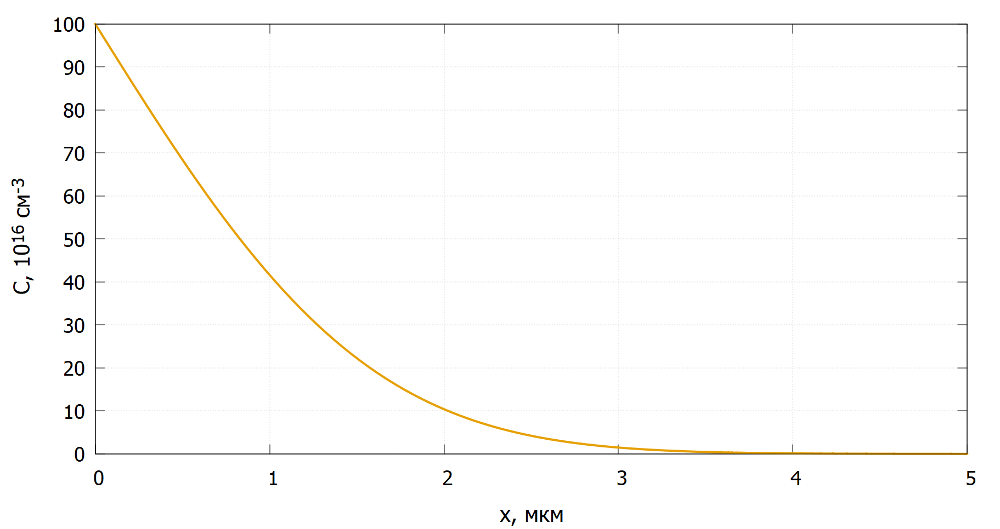
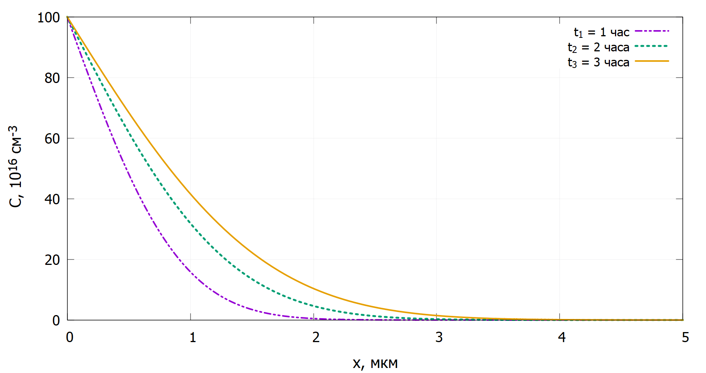

# Математическое моделирование метода диффузии в полупроводниках
Рассмотрен процесс одномерной диффузии легирующей примеси из источника бесконечной мощности.
## Результаты
Время диффузии Т~диф~ = 3 часа

Процесс диффузии в различные моменты времени:

Глубина залегания примеси при N~d~ = 1015 см-3
