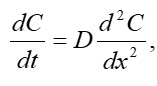
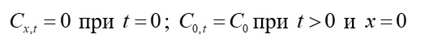

# Математическое моделирование метода диффузии в полупроводниках
Реализован процесс одномерной диффузии легирующей примеси из источника бесконечной мощности
##

## Математическая модель
Математическая модель, описывающая процесс диффузии и основанная на законах Фика, имеет вид:

где C – концентрации диффундирующей примеси,
D – коэффициент диффузии.
D = D0 = 7∙10-13 см2/c
Начальные и граничные условия для решения уравнения диффузии из источника бесконечной мощности:

С0 = 1018см-3
Время диффузии Тдиф = 3 часа
Блок схема нахождения численного решения уравнения:

## Результаты
При Тдиф = 3 часа

Процесс диффузии в различные моменты времени:

Глубина залегания примеси при Nd = 1016 см-3
